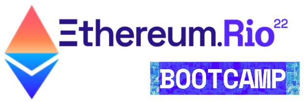
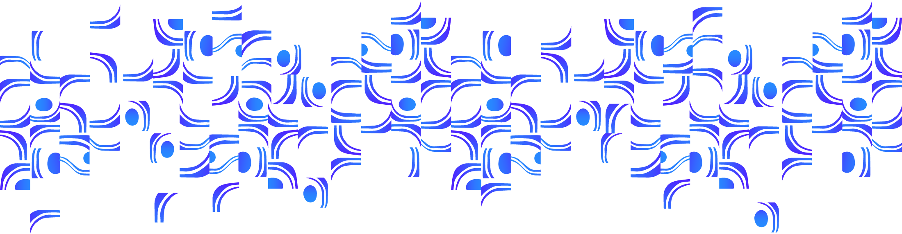

# EthereumRIO 2022 Solidity Showcase

This repository is a showcase that contains the code and content created during the Ethereum Rio Bootcamp, that took place in Rio de Janeiro in 2022 during 11 to 13 march 2022. Each folder of this repository will have a small code and/or a README describing how to do an operation.

## Ethereum RIO Bootcamp 2022
The Ethereum RIO bootcamp 2022 was a hosted event before the Ethereum RIO 2022 main event//conference.

The event purpose was of form more web3 developers, by teaching not only blockchain but smart contracts too. We learned the concepts of it, keywords, some background history on they why of each feature. We learned how to deploy, use test-nets, faucets and much more.

After completing the course we would have a more broad knowledge of what is blockchain, dApps and be able to understand
how smart contracts works, from creation to deployment and validation.

## Folders

A Small description of the folder as an index to actually know which is which while browsing this repo.

### [0_web3: Wallets, Etherscans and entering the web3](0_web3/README.md)

Without an wallet and certain tools you can't really use web3 since most of it needs an wallet, hashes and accesses for some restricted content in the blockchain.

### [1_hello_world: Your first Smart Contract](1_hello_world/README.md)

A hello world in solidity. This part follows how to do a hello world, deploy and some ways of testing the solidity code.

### [2_solidity_fundamentals: More about Solidity itself](2_solidity_fundamentals/README.md)

More info about code structures, certain keywords and other details of solidity.

### [3_scaffold_and_token: Details of scaffold_eth](3_scaffold_and_token/README.md)

A quick brief intro to the scaffold_eth tool to develop contracts.
### [4_ethereum_patterns_ERC: What is the ERC and a minimal token](4_ethereum_patterns_ERC/README.md)

An introduction we had to ERC and the first token we have created.

### [5_hardhat_infura: A DevTool and a dev service.](5_hardhat_infura/README.md)

What is the hardhat and infura, getting to use them, great developers tools to pave your way into the web3.

### [6_web3_frontend: Integrating contracts to platforms.](6_web3_frontend/README.md)

Studying a react git to see how it's possible to integrate a contract to a react app. And this can be done in diverse programming languages this is just an study case with react.

### [7_chainlink_keepers: Automating smart contracts.](7_chainlink_keepers/README.md)

How to use chainlink keepers to run functions in the smart contract autonomously.

### Resources

Only a folder to store the images and other files that are related to the project and is probably used in one of READMEs present in this git repository.

#### Acknowledgment

I would like to acknowledge and thanks for the team that come up with the event and in special to [Sol](https://github.com/solangegueiros) due to her wonderfull didactic.
To all the friends made, highlighting Antonio from [Criptonomia](https://criptonomia.com/), and the guys from Pods and Defi Basket.

